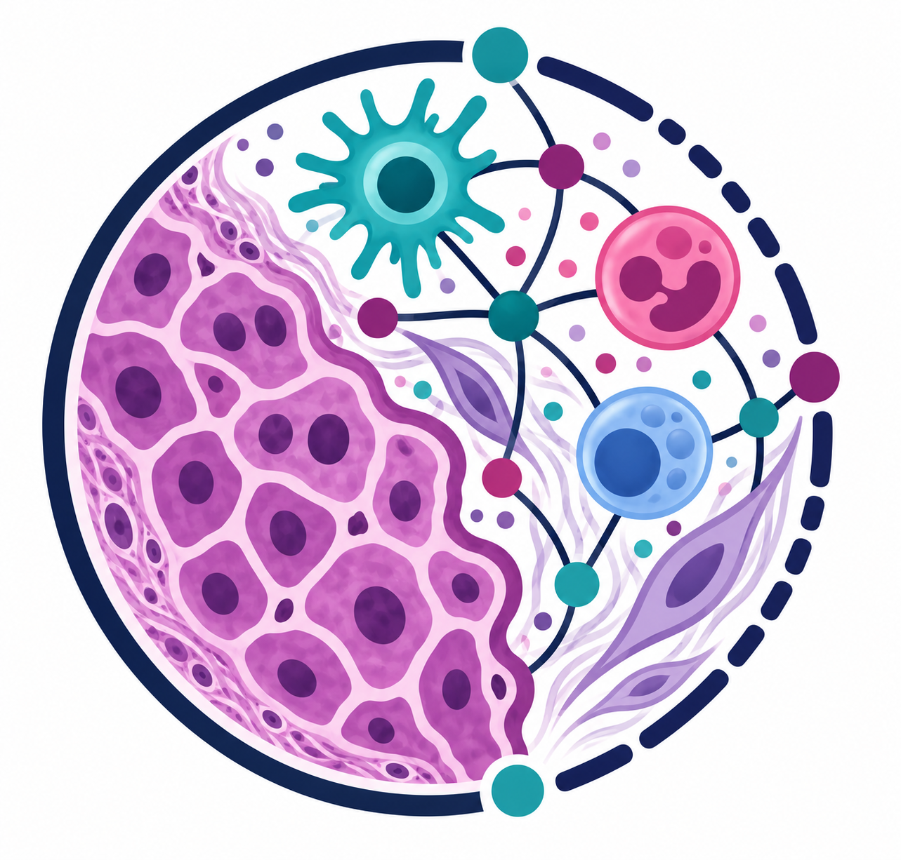
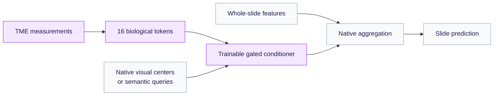

<p align="center">
  
</p>

<h1 align="center">PathoTME</h1>

<p align="center">
  <strong>Whole-slide learning, grounded in tumor biology.</strong><br>
  <em>Anonymous research submission</em>
</p>

<p align="center">
  <a href="#overview">Overview</a> ·
  <a href="#method">Method</a> ·
  <a href="#study-design">Study design</a> ·
  <a href="#getting-started">Getting started</a> ·
  <a href="#project-website">Project website</a> ·
  <a href="#acknowledgements">Acknowledgements</a>
</p>

---

<a name="overview"></a>

## 🔬 Overview

**PathoTME** studies how quantitative **tumor microenvironment (TME)** measurements
can condition whole-slide pathology models. Tissue organization, cell composition,
and spatial relationships provide a biological vocabulary that complements visual
patch features.

The central question is: **does slide-specific biological context improve a model's
aggregation beyond its native representation and the capacity of an added conditioner?**

A shared biological interface connects to six architectures, with matched controls
across two TCGA cohorts and two visual encoders.

<a name="method"></a>

## 🧠 Method

PathoTME groups quantitative measurements into **16 biological tokens**. A trainable
cross-attention conditioner reads these tokens and adds a gated residual to a
model's existing visual centers or encoded semantic queries. The native model's
parameters remain frozen during adaptation.



**The actual-TME model requires biological measurements at inference.** The
conditioner changes representations consumed by the model; original prompt
strings remain separate from the quantitative measurements.

<a name="supported-architectures"></a>

## 🧩 Supported architectures

The interface follows each architecture's existing computation.

| Architecture | Visual scales | TME-conditioned representation |
|---|---|---|
| [ViLa-MIL](pathotme/guided_vila_adapter.py) | 5× + 10× | Image-center queries before patch aggregation |
| [MGPATH](pathotme/guided_mgpath_adapter.py) | 5× + 10× | Image-center queries before graph aggregation |
| [FOCUS](pathotme/focus_tme.py) | 20× | Encoded semantic queries before patch selection and final attention |
| [MUSE](pathotme/muse_tme.py) | 10× | Inference class semantics before sparse expert routing |
| [HiVE-MIL](pathotme/hive_tme.py) | 5× + 20× | Encoded hierarchical text nodes before filtering and graph construction |
| [DyKo](pathotme/dyko_tme.py) | 20× | Class queries after concept retrieval and before dual cross-attention |

The paired PLIP/CLIP-RN50 implementations include explicit PathoTME encoder
extensions. Discrete retrieval and selection operations remain non-differentiable;
continuous attention and graph computations provide the conditioner’s training signal.

<a name="study-design"></a>

## 🧪 Study design

The primary design uses **16 shots per class**, **five patient-disjoint folds**, and
**PLIP / CLIP-RN50**, with common cohort manifests and matched splits.

| Cohort | Classification task | Slides | Patients | Biological panel |
|---|---|---:|---:|---|
| TCGA-NSCLC | LUAD vs. LUSC | 1,041 | 944 | core62 |
| TCGA-BRCA | IDC vs. ILC | 960 | 900 | morph64 |

Every architecture/cohort/encoder/fold comparison includes four conditions:

| Condition | Biological input | Comparison purpose |
|---|---|---|
| **Native** | No TME conditioner | Establish the matched starting point |
| **Zero TME** | Standardized measurements set to zero | Account for added conditioner capacity |
| **Shuffled TME** | A different patient's TME row within the same split | Test whether the slide–TME match matters |
| **Actual TME** | The slide's own measurements | Test the contribution of matched biological context |

Actual, zero, and shuffled arms share capacity, initialization, and selection rules.
Imputation and normalization are fitted on training slides only. A separate 4- and
8-shot extension covers ViLa-MIL and MGPATH.

This is an exploratory study. The README and project website present the method
and experimental design; performance results are not shown here.

<a name="biological-panels"></a>

## 🌿 Biological panels

The panels are hand-defined by biological role and available quantitative
measurements from [Aignostics / OpenTME](https://huggingface.co/datasets/Aignostics/OpenTME).

- **NSCLC · core62:** 14 tissue, 28 cell-composition, 16 spatial-interaction, and
  4 lymphoid-organization measurements, arranged into 16 groups.
- **BRCA · morph64:** 24 tissue-structure/morphology, 28 cell-composition, and
  12 spatial-interaction measurements, arranged into 16 groups.

These fixed panels express biological hypotheses; the study does not establish
that they are optimal or exhaustive. See the [exact panel definitions](docs/data/panels.json)
for ordered features, semantic groups, source columns, and the pinned data revision.

<a name="getting-started"></a>

## 🚀 Getting started

The research package supports **Python 3.10–3.11**. Install the base package with:

```bash
git clone https://github.com/researchsubmissions66/PathoTME.git
cd PathoTME
python -m pip install -e .
```

Architecture runners also require the corresponding PGVL-Gym environment, paired
encoder weights, slide features, and TME measurements. These assets are obtained
separately; the base package installation does not download them.

Configure the anonymous `/path/to/...` placeholders and `YOUR_SLURM_ACCOUNT` for
your environment, then use the [study configurations](configs/) and
[research scripts](scripts/) to prepare the relevant experiment. Data, weights,
patient measurements, and local run artifacts are excluded from this repository.

<a name="project-website"></a>

## 🌐 Project website

The [project website source](docs/) includes an interactive architecture explorer,
both biological panels, and the matched study protocol. Preview it locally:

```bash
python3 -m http.server 8000 --directory docs --bind 127.0.0.1
```

Open **http://localhost:8000**. The site needs no build step or training dependencies
and supports desktop, mobile, and keyboard navigation.

<a name="repository-layout"></a>

## 🗂️ Repository layout

```text
PathoTME/
├── pathotme/       # Biological panels, conditioners, and model integration
├── configs/        # Study configurations
├── scripts/        # Data preparation and research entry points
├── text_prompts/   # Separate text assets and provenance
├── tests/          # Focused research checks
└── docs/           # Project website, logo, and panel definitions
```

<a name="acknowledgements"></a>

## 🙏 Acknowledgements

We thank **Aignostics and the OpenTME contributors** for providing the quantitative
tumor microenvironment profiles used in this study and the tools for exploring them.

- **GitHub:** [TME Studio — the official OpenTME exploration toolkit](https://github.com/aignostics/tme-studio).
- **Hugging Face:** [Aignostics / OpenTME dataset](https://huggingface.co/datasets/Aignostics/OpenTME).
- **Reference:** [Galama et al., *OpenTME: An Open Dataset of AI-powered H&E Tumor Microenvironment Profiles from TCGA* (2026)](https://arxiv.org/abs/2604.12075).

**Raw OpenTME measurements and extracted WSI feature arrays are not distributed
in this repository.** Request dataset access through the official Hugging Face
page and follow its access and use terms. The published
[panel definitions](docs/data/panels.json) contain feature names, semantic groups,
and source-column metadata, not patient- or slide-level measurement rows.

## Additional research tools

The repository also includes an [MSCPT conditioner](pathotme/mscpt_tme.py),
[matched logistic-regression and probability-fusion baselines](campaigns/baselines_20260914/),
[TME attribution](pathotme/attribution.py), and [additional experiment runners](campaigns/).

Machine-specific paths use `/path/to` placeholders. Configure these paths and
regenerate experiment contracts before launching in your environment.

## Text prompt banks

All seven architectures’ text banks for NSCLC, BRCA, CRC, and BLCA are indexed in [text_prompts/README.md](text_prompts/README.md), including native source snapshots and provenance hashes.
